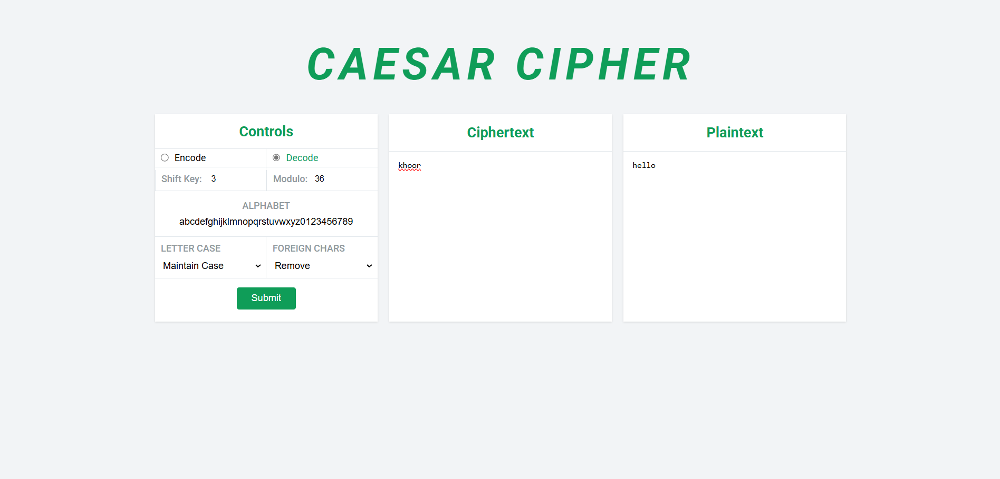

# Caesar Cipher

A simple web-based implementation of the **Caesar Cipher**, a classical encryption technique used for encoding messages by shifting letters in the alphabet.

## Features
- Encrypt and decrypt messages using the Caesar Cipher technique.
- Adjustable shift key for encoding and decoding.
- User-friendly interface built with **HTML, CSS, and JavaScript**.

## How It Works
The Caesar Cipher shifts each letter in the plaintext by a fixed number (shift key). For example, with a shift of 3:
- `A` → `D`
- `B` → `E`
- `C` → `F`

To decrypt, simply shift the letters backward by the same number.

## Installation
To run this project locally:
1. Clone the repository:
   ```bash
   git clone https://github.com/11Yashyadav/My-Caesar-Cipher.git
   ```
2. Navigate to the project folder:
   ```bash
   cd My-Caesar-Cipher
   ```
3. Open `index.html` in a web browser.

## Usage
1. Enter the text you want to encrypt or decrypt.
2. Choose a shift value.
3. Click **Encrypt** or **Decrypt** to see the result.

## Files Overview
- `index.html` - Main structure of the web app.
- `style.css` - Styles for the web page.
- `caesar.js` - JavaScript logic for encryption and decryption.

## Example
With a **shift of 3**, the message:
```
HELLO WORLD
```
Becomes:
```
KHOOR ZRUOG
```

## Preview
### Normal Page


### Encoding Example


### Decoding Example


## Author
Developed by **Yash Yadav**.

